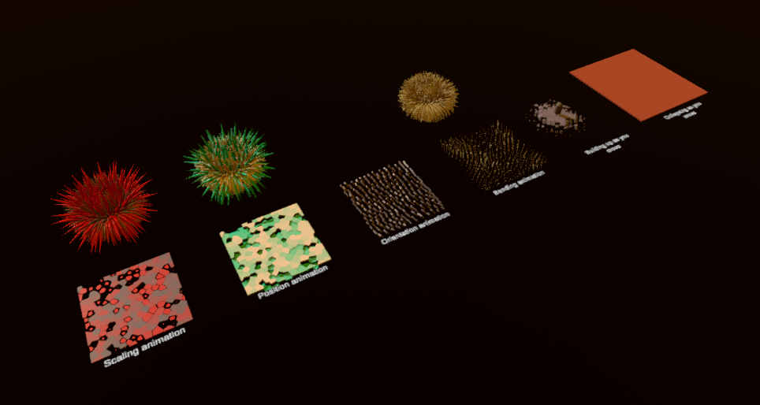
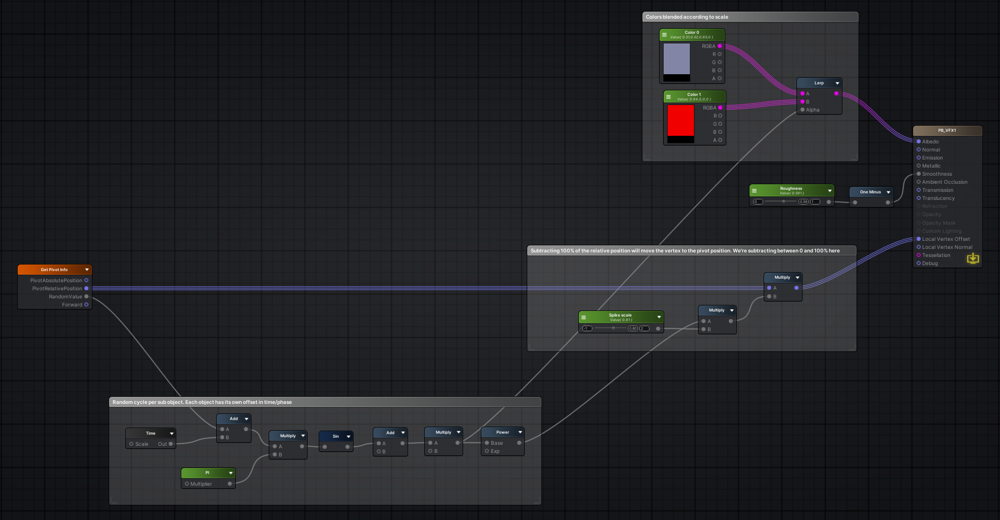

Unity pivot baking samples using the Houdini node made for Unreal
==================================================================
This is a repository that contains examples on how to use the pivot baking 
tool from SideFX in unity.

The project is provided AS IS, I will not provide any support for this, 
you have the code, you have some samples and it's provided for free.

In the demo scene you can use the cursor keys to move the capsule around.

  

System requirements
-------------------

- Unity 2019.4.19f1 

Creating you own compatible shader
----------------------------------
The provided shader has been made with Amplify shader editor and you can easily modify it to match your needs.
You need to install Amplify shader editor in the project in order to edit the shaders properly.
If you want to create an HLSL shader or HDRP/URP shader, it should be pretty straightforward to do it.

 

Houdini sample provided in the project
---------------------------------------
You can use freely the provided sample file. The Houdini file is located in the Resources directory and has been made with an educational version of Houdini.
You need to install the labs tools in order to export properly.

Can I use this freely?
-----------------------
Feel free to use this in your projects, improve it, modify it ... 
Just don't sell it and make profit out of it please, it is free on purpose.
